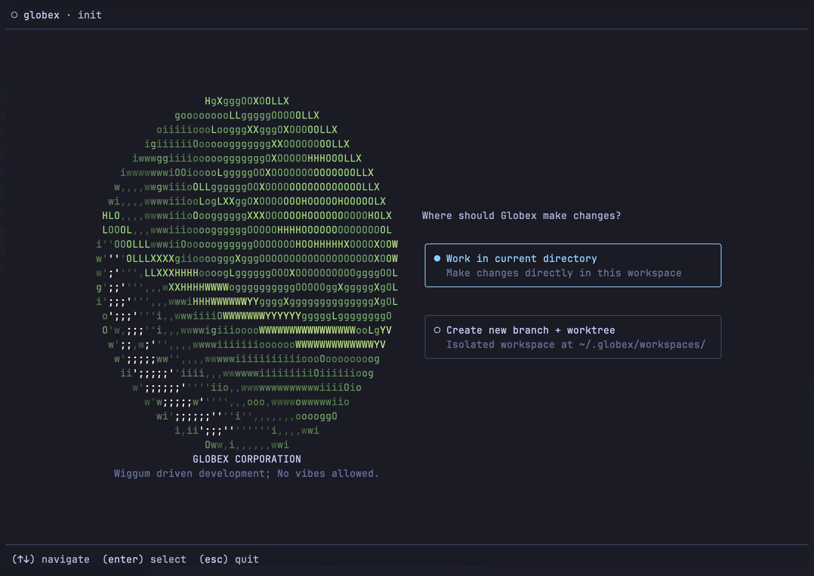
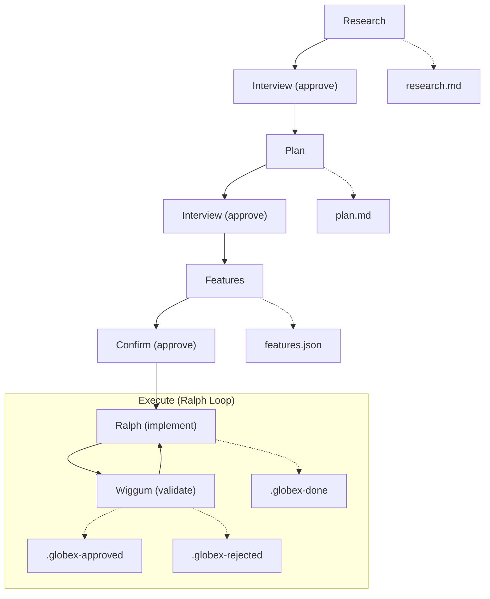

<p align="center">
  
</p>

<h1 align="center">Globex</h1>

<p align="center">
  <strong>PRD interviews with a Ralph/Wiggum execution loop</strong>
</p>

<p align="center">
  CLI tool powered by <a href="https://opencode.ai">OpenCode</a>
</p>

<p align="center">
  <a href="#what-it-is">What It Is</a> •
  <a href="#why-its-useful">Why It’s Useful</a> •
  <a href="#features">Features</a> •
  <a href="#screenshot">Screenshot</a> •
  <a href="#usage">Usage</a>
</p>

---

## What It Is

Globex is a CLI + TUI for turning a rough idea into a validated spec and then executing it with an agentic loop.

- Generates `research.md`, `plan.md`, and `features.json`
- Requires human approval at each spec phase
- Runs an implementation loop with independent validation

## Why It’s Useful

- Converts vague ideas into concrete, reviewable artifacts
- Forces alignment before code changes begin
- Keeps execution iterative and accountable

---

## Philosophy

> "Human leverage is highest at spec level, lowest at implementation."

Front-load human validation into research and planning. Execution runs autonomously.

Named after Hank Scorpio's company. The "Ralph loop" is named after Ralph Wiggum—persistent iteration despite setbacks.

**Based on:**
- [Anthropic: Effective Harnesses for Long-Running Agents](https://www.anthropic.com/engineering/effective-harnesses-for-long-running-agents)
- [HumanLayer: ACE-FCA](https://github.com/humanlayer/advanced-context-engineering-for-coding-agents/blob/main/ace-fca.md)
- [Geoffrey Huntley: Ralph Driven Development](https://ghuntley.com/ralph/)
- [opencode-ralph](https://github.com/Hona/opencode-ralph)

## Disclaimer

Globex is an independent project and not affiliated with or endorsed by The Simpsons, Fox, or Disney. Names and likenesses are used for humor; all trademarks belong to their respective owners.

## Features

- **Standalone CLI** — Run `globex` from any project directory
- **TUI interface** — Real-time progress display with OpenTUI
- **@ file references** — Autocomplete to attach files to your project description
- **OpenCode SDK integration** — Spawns sessions for each agent
- **Phase-based workflow** — Research, plan, features, execute
- **Coach/player pattern** — Ralph implements, Wiggum validates

---

## Screenshot



---

## Flow




Each phase requires human approval before proceeding.

---

## Installation

### Via npm

```bash
npm install -g opencode-globex
```

### From source

```bash
git clone https://github.com/lleewwiiss/opencode-globex.git
cd globex
bun install
bun run build
bun link
```

This makes the `globex` command available globally.

---

## Usage

### Initialize a new project

```bash
globex init "Add dark mode support"
```

Default model: `openai/gpt-5.2-codex` (variant `high`).

### Resume a project

```bash
globex                       # Resume active project
globex --project my-project  # Run specific project
```

### Manage projects

```bash
globex status
globex switch my-project
globex abandon my-project --force
```

### Worktrees

```bash
globex workspace list
globex workspace cleanup
```

### Options

```bash
globex --help
globex --model anthropic/claude-sonnet-4
```

---

## Ralph Loop

Coach/player pattern with two agents per iteration:

1. **Ralph (player)** — Implements ONE feature, writes `.globex-done` in project workdir
2. **Wiggum (coach)** — Validates implementation against acceptance criteria
   - Writes `.globex-approved` on success
   - Writes `.globex-rejected` with JSON reasons on failure
3. On rejection, Ralph retries with feedback in next iteration
4. Fresh context between iterations (stateless execution)

Loop continues until all features complete.

### Feature Sizing

Features sized for ~50% of agent context window:

| Constraint | Limit |
|:-----------|:------|
| Time | 30-60 min |
| Files | 10-20 max |
| Lines | ~500 max |
| Dependencies | 0-2 features |

### Feature States

| State | Description |
|:------|:------------|
| `passes: false` | Not yet implemented |
| `passes: true` | Implemented and verified |
| `blocked: true` | Cannot progress (skipped by loop) |

---

## Project Structure

```
globex/
├── cli/
│   ├── bin/
│   │   └── globex.ts          # CLI entry point (yargs)
│   ├── src/
│   │   ├── index.ts           # Main entry, TUI startup
│   │   ├── app.tsx            # TUI application (OpenTUI/Solid)
│   │   ├── loop/
│   │   │   ├── ralph.ts       # Ralph loop executor
│   │   │   └── signals.ts     # File marker detection
│   │   ├── phases/
│   │   │   ├── engine.ts      # Phase execution engine
│   │   │   └── approval.ts    # Approval handling
│   │   ├── agents/
│   │   │   ├── prompts.ts     # Prompt loader
│   │   │   └── prompts/       # Prompt markdown
│   │   ├── opencode/
│   │   │   ├── server.ts      # OpenCode server management
│   │   │   ├── session.ts     # Session handling
│   │   │   └── events.ts      # Event subscription
│   │   ├── state/
│   │   │   ├── types.ts       # TypeScript types
│   │   │   ├── schema.ts      # Effect Schema definitions
│   │   │   └── persistence.ts # State CRUD
│   │   ├── features/
│   │   │   └── manager.ts     # Feature tracking
│   │   ├── artifacts/
│   │   │   ├── save.ts        # Artifact persistence
│   │   │   └── validators.ts  # Citation validation
│   │   ├── components/        # TUI components
│   │   ├── config.ts          # Configuration loading
│   │   └── git.ts             # Git operations
│   └── tests/                 # Test files
├── .globex/                   # Runtime state (gitignored)
├── package.json
└── tsconfig.json
```

---

## State Files

```
.globex/
├── config.json             # CLI configuration
└── projects/{projectId}/
    ├── state.json          # Phase, approvals, execution state
    ├── research.md         # Research findings
    ├── plan.md             # Implementation plan
    ├── features.json       # Feature list with pass/fail status
    └── progress.md         # Current progress
```

---

## Development

```bash
bun run check    # lint + build + test
bun run lint     # oxlint cli/src/
bun run build    # tsc
bun test         # all tests
```

---

## Acknowledgements

### [OpenCode](https://github.com/anomalyco/opencode)

Globex uses the OpenCode SDK for agent sessions.

### [opencode-ralph](https://github.com/Hona/opencode-ralph)

Reference implementation for a Ralph-style loop.

### [Geoffrey Huntley's Ralph Driven Development](https://ghuntley.com/ralph/)

Original write-up of the Ralph loop concept.

---

## License

MIT

---

<p align="center">
  <em>"Don't call me Mr. Scorpion. It's Mr. Scorpio, but don't call me that either."</em>
</p>
